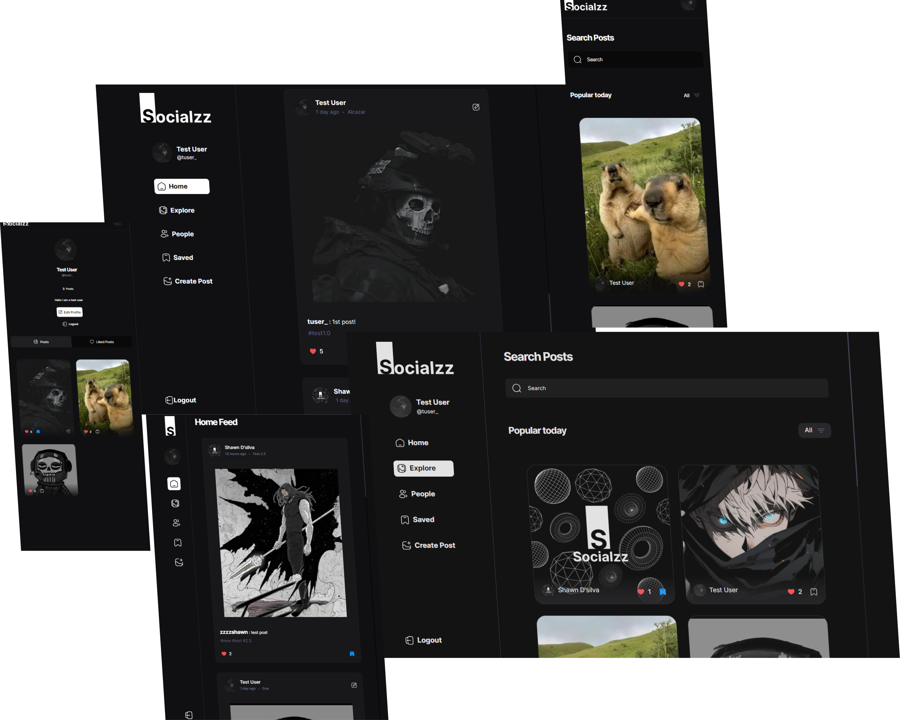

### 

### 

## Overview 🚀

 Socialzz is a social media application that allows users to connect with each other, share posts, and explore content. This repository contains the source code for Socialzz.


## Features

- 🚫 **User Authentication**: Users can sign up and log in securely.
- 👤 **Profile Management**: Users can edit their profiles, including their name, username, email, bio, and profile picture.
- 📱 **Post Creation and Editing**: Users can create new posts and edit existing ones.
- 🖼️ **Post Details**: Users can view detailed information about a specific post, including the post's creator, caption, tags, and creation date.
- 🏞️ **Explore Posts**: Users can explore posts with features like search, infinite scroll, and filtering.
- 🏡 **Home Feed**: Displays recent posts in the user's home feed.
- 👍 **Liked Posts**: Shows posts that the current user has liked.
- 👥 **All Users**: Displays a list of all users registered on the platform.
- **Responsive Layout**: The application layout is responsive and adjusts to different screen sizes.

## Technologies Used

-  **React**: Frontend library for building user interfaces.
- **React Router**: For declarative routing in the application.
- **React Hook Form**: For building flexible and efficient forms.
- **React Query**: For data fetching and caching.
- **Tailwind CSS**: Utility-first CSS framework for styling components.
- **Zod**: Runtime type checking for JavaScript.
- **Appwrite**: Authentication and user management


## Usage

Each component is designed to be modular and reusable. You can integrate these components into your own React projects by copying the relevant files and importing them into your application. Make sure to review the documentation and comments within each component for usage instructions and customization options.

## Contributing

Contributions are welcome! If you encounter any bugs, have feature requests, or want to contribute improvements, please open an issue or submit a pull request.

## License

This project is licensed under the MIT License. See the [LICENSE](LICENSE) file for details.

## Guest Login

Use these credentials to test the application as a guest

```javascript
email: guest@guest.com
password: 12345678
